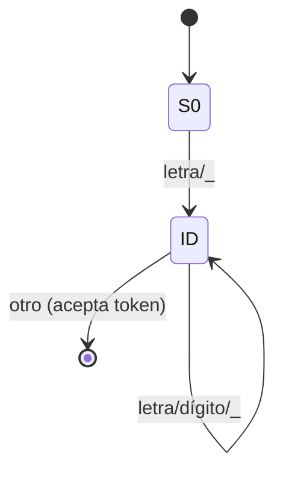
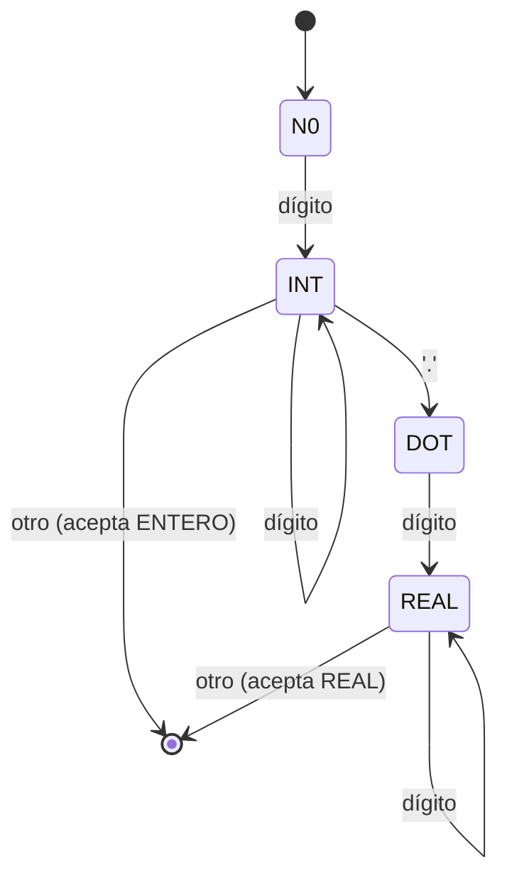

# Autómata (explicación breve)

FLEX construye un **autómata finito determinista (DFA)** a partir de expresiones regulares. A nivel conceptual:

1) Cada regex se convierte en un NFA (Thompson).
2) Los NFA se combinan.
3) Se determiniza (subset construction) para obtener un DFA.
4) El DFA se minimiza/optimiza y se genera código C.

## Ejemplo 1: Identificadores

Regex: `[A-Za-z_][A-Za-z0-9_]*`

## Ejemplo 2: Números (entero vs real)

Regexs:

- Entero: `[0-9]+`
- Real: `[0-9]+\.[0-9]+`

Idea: el DFA consume dígitos; si aparece `.` pasa a un estado de “real” que requiere al menos un dígito más.

## Nota sobre prioridad de reglas

FLEX elige:

- **Longest match** (consume el lexema más largo posible).
- Si hay empate, gana la **primera regla** en el archivo `.l`.
